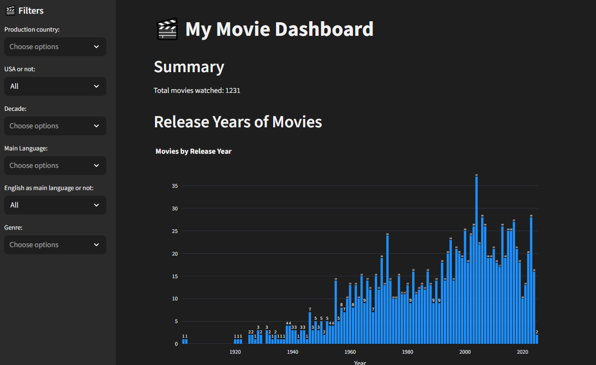
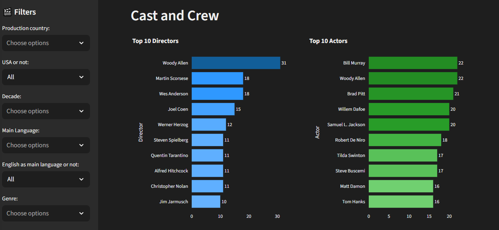
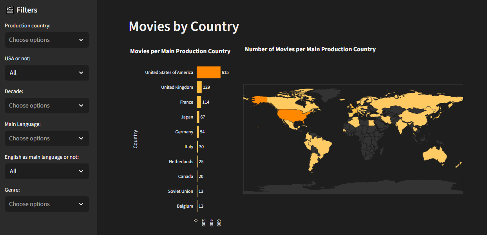

# Movie dashboard
I built this Streamlit dashboard to explore my movie-watching habits — showing insights by genre, country, and director.  
This public version showcases the data workflow and visualization components using example data

## Project Overview
This project demonstrates how to build a data visualization dashboard with Python and Streamlit.  
It combines movie metadata from TMDb with locally provided film data.

## Example screenshots of the dashboard




## Features
- Reads movie lists or diary exports (CSV format)
- Fetches TMDb metadata (runtime, genres, directors, etc.)
- Caches metadata locally to minimize API calls
- Cleans and prepares data for visualization
- Interactive dashboard built with Streamlit and Plotly

## Folder structure
```
movie_dashboard/
│
├── data/
│   └── raw
|       └── samples_movies.csv          # CSV containing films with TMDb IDs     
│   └── cache
│       └── tmdb_data.csv               # after running scripts/update_cache: cache with metadata for each film retrieved from TMDb API   
│   └── processed
│       └── final_movies.csv            # Cleaned CSV for dashboard      
|
├── src/
│   ├── check_cache.py                  # Used to check cache
│   ├── config.py                       # config
│   ├── dashboard.py                    # Streamlit app logic (UI components, plots)
│   ├── graphs.py                       # helper functions for graphs used in streamlit dashboard
│   ├── helpers.py                      # Miscellaneous helper functions
│   ├── tmdb_api.py                     # functions to fetch and process TMDb data
│   └── tmdb_explore.py                 # functions used to explore TMDb data
│
├── scripts/
│   ├── update_cache.py                 # script to update cache
│   └── prepare_df.py                   # script to prepare df for visualization
│
├── .streamlit/
│   └── config.toml                     # config file for streamlit theme
│
├── main.py                             # entry point to launch the Streamlit app
├── requirements.txt                    # dependencies
├── README.md                           # project description, setup instructions
└── .gitignore                          # ignore data, envs, __pycache__, etc.
```

## Setup
### Install dependencies
Run in terminal:
```terminal
pip install -r requirements.txt
```

### API Key
The script `scripts/update_cache.py` uses TMDb's public API. 
You’ll need an API key from [The Movie Database](https://developer.themoviedb.org/docs/getting-started).
For security, the key should be stored in a `.env` file in the project root (not commited to git). 
The code reads this file to access the key.

Example `.env` file:
```
TMDB_API_KEY=your_api_key_here
```
Make sure to create this file before running `update_cache.py`, otherwise the scripts won’t be able to fetch TMDb data.

### Data
This project uses a small sample dataset of movies for demonstration purposes.  
Each movie entry includes basic information such as title, year, and TMDb ID.
You can replace the sample data with your own movie list (in CSV format) to explore the dashboard with personal data.

## Usage
### 1. (Optional) Collect your movie data
Replace `raw/sample_movies.csv` with your own movie data. 
The data should at least contain the TMDb ID for each film in the column `tmdb_id`.
In the script `scripts/update_cache`, make sure the variable MOVIES_CSV refers to the correct file.

### 2. Update Cache
Use the script `scripts/update_cache.py`
   - Fetches full TMDb metadata for each film and stores it locally in `data/cache/tmdb_data.csv`.  

To run the script in the terminal:
```terminal
python scripts/update_cache.py
```

### 3. Prepare Dataframe for visualization
Use the script `scripts/prepare_df.py` 
   - Cleans and prepares the cached data for visualization.  

TO run the script in the terminal:
```terminal
python scripts/prepare_df.py
```

### 3. Run Dashboard 
Use the script `main.py`
   - Launches a Streamlit dashboard to explore movies, directors, and trends.

To run the streamlit app in the terminal:
```terminal
streamlit run main.py
```

### Cache Management
The project uses a local cache folder to store TMDb API responses for movies. This speeds up repeated queries and reduces API calls.
- Cache location: `CACHE_DIR` (defined in config.py)

## Disclaimer
- This project uses example movie data for demonstration purposes only.  
- It is intended for personal, educational and non-commercial use only.
- Uses Python 3.13.7
